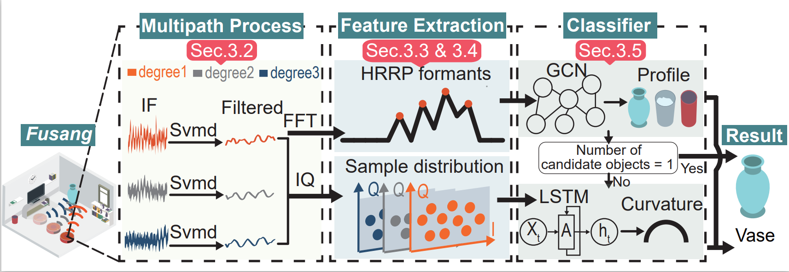

# Pro-Fusang
 This repository is an Open-source code for the paper "Fusang: Graph-inspired Robust and Accurate Object Recognition on Commodity mmWave Devices". 


## Abstract
>Fusang is a novel object recognition system that only requires a single COTS mmWave Radar. It uses HRRP data and IQ 
samples of the reflected radar signals to achieve robust and accurate object recognition without relying on target augmentation 
or specialized optical hardware.

>The basic idea of Fusang is leveraging the large bandwidth of mmWave Radars to capture a unique set of fine-grained reflected responses generated by object shapes. Moreover, Fusang constructs two novel graphstructured features to robustly represent the reflected responses of
the signal in the frequency domain and IQ domain, and carefully designs a neural network to accurately recognize objects even in
different multipath scenarios. We have implemented a prototype of Fusang on a commodity mmWave Radar device. Our experiments with 24 different objects show that Fusang achieves a mean accuracy  of 97% in different multipath environments.

## Overview


## Quick Start

### 1. Environment installation
Before you begin the following steps, make sure that you do the following experiment setup:

- Operating system: Windows 10
- Matlab R2021b or higher

#### 1.1 Setup Conda
```
# Conda installation

# For Windows
$ Download from official website: https://www.anaconda.com/
```

#### 1.2 Setup Python environment
```
# Clone GitHub repo
$ conda install git
$ git clone https://github.com/OpenNISLab/Pro-Fusang.git
$ cd Pro-Fusang

# Install python environment
$ cd 04_gnns_hrrp
$ conda env create -f environment.yml   
$ cd 05_rnns_iq
$ conda env create -f environment.yml 

# Activate environment
conda activate envs
```

### 2. Download datasets 
We train and test Fusang with real data collected from our Ti-IWR1843 millimeter-wave radar. 
We pick 24 objects that are most frequently seen in the indoor environment (including multiple materials, 
curvatures and sizes) to evaluate the performance of Fusang, especially in offices and houses.
For each object, we rotate each object and collect the reflected signals at 9 angles (From
0-180 degrees, 20 degrees at per time) spanning distances of 1-5m. 
To ensure the reproducibility of our paper's results, we have shared 
[raw data](https://1drv.ms/u/s!AuVCef5KAvp_gQiS0yWWS__2waP6?e=K4nNt3 "Sec.5.1 raw data") 
and preprocessed dataset on GitHub, named *00_Fusang_dataset*. 
You can use this data to replicate the results presented in Section 5.1 of our paper.
The total datasets (94.5GB uncompressed) used in the Fusang system can be downloaded from
[here](https://1drv.ms/u/s!AuVCef5KAvp_gQf8LDiXAiQEQ_dZ?e=vMbTm9 "All raw data").

```
# The entire datasets used in our experiment
All_radar_datasets_Fusang:
├─Sec.5.1_Overall_Performance
│  └─20221119 (raw_radar_dataset.zip)
├─Sec.5.2_Robustness
│  ├─Different_Angle
│  │  └─20221128
│  ├─Different_Environments
│  │  ├─20221119 (Seminar)
│  │  ├─20221128 (Office)
│  │  └─20221130 (Hall)
│  └─Distances
│      ├─20221122 (5m)
│      ├─20221125 (4m)
│      ├─20221126 (3m)
│      ├─20221127 (2m)
│      └─20221128 (1m)
└─Sec.5.3_Dynamic_Case_Study
    └─20221204
        ├─Moving_cart (Office)
        └─Moving_hand (Office)
```

### 3. Step-by-Step Instructions
*Disclaim: (1) Due to the project intermediate data more. Please note the data path switching when using part of the code.
At the same time, we are currently working on updating our code to reduce the manual data path modification process.\
(2) Although we have worked hard to ensure our code are robust, our tool remains a research 
prototype. It can still have glitches when using in complex, real-life settings. If you discover any bugs, 
please raise an issue, describing how you ran the program and what problem you encountered. 
We will get back to you ASAP. Thank you.* 

#### 3.1 Data preprocessing
*(approximate runtime: ~0.6s per signal, ~16 hours in total when using a CPU)*

* Svmd precessing. The data received by radar is first decomposed by svmd to eliminate the influence of multipath noise.
```
# Run the IF_svmd.m in the 01_svmd_precessing
```
* Hrrp generation. The hrrp formants of the target reflected signal is extracted.
```
# Run the calculate_Extreme_values.m in the 02_hrrp_generation/Adaptive threshold Method1
```
**Note**: Adaptive threshold method 1 and 2 can be used without essential difference, and the processing results are similar.
Of course, we also provide the processed data stored in folder 00_Fusang_dataset/svmd_filtered_dataset. You can directly 
use this data for further operations or verify the transparency of the data preprocessing code.

#### 3.2 Feature extraction
*(approximate runtime: ~10 minutes when using a CPU)*

After the filtered radar signal is obtained, the system extracts the energy distribution of target 
radar echo in IQ domain and Hrrp respectively.
* *Leaves* feature. It's used to represent the energy distribution of target curvature in IQ domain.
```
# Run the IF_IQdomain_calculate_Point_density.m in the 03_curvature_extraction
# Run the data_preprocessed.m in the 03_curvature_extraction
```
* *Branches* feature. It's used to represent the energy distribution of two-dimensional target profiles in hrrp data.
```
# Construct the graph feature based on hrrp
$ cd 04_gnns_hrrp/Fusang_graph_data_preprocess
$ python Fusang_maketree_process_4.0.py
$ python Fusang_maketu_process2TU.py
```
**Note**: The preprocessed data path in Section 3.1 needs to be provided with the above code.

#### 3.3 Training model
*(approximate runtime: ~4 hour using a GPU， 20 hours using a CPU)*

&#9733; Gcn model.
```
# Run the main file (at the root of the 04_gnns_hrrp)
$ cd 04_gnns_hrrp
$ python main_Fusang_profile_classification_train.py --config 'configs/TUs_graph_classification_GCN_HRRP_train.json' # for CPU
$ python main_Fusang_profile_classification_train.py --gpu_id 0 --config 'configs/TUs_graph_classification_GCN_HRRP_train.json' # for GPU
```
The training and network parameters for each dataset and network is stored in a json file in the `configs/` directory.

&#9733; LSTM model.
```
# Run the main file (at the root of the 05_rnns_iq)
$ cd 05_rnns_iq
$ python main_Fusang_curvature_classification_train.py 
```

&#9733; Fusion model.\
In this stage, we set two thresholds *(Absolutely_right_threshold_value* and *Be_about_right_threshold_value)* artificially 
to adjust the output weights of the hybrid modelnetwork, and the determination of the thresholds depends on a large number 
of labeled training data.
After conducting numerous tests, we found that two values in the experiment remain relatively stable. However, if you wish
to use our system to recognize your own dataset, it may be necessary to retrain the threshold parameters.
```
# Iteratively search thresholds within [0, 1] until the system achieves maximum accuracy.
```

#### 3.4 Testing
*(approximate runtime: ~10 minutes)*

The training set and test set are generated separately in the data preprocessing stage of Section 3.1 to ensure that the target 
to be tested has not been trained in advance.

&#9733; Gcn model.
```
# Run the main file (at the root of the 04_gnns_hrrp)
$ cd 04_gnns_hrrp
$ python main_Fusang_profile_classification_test.py --config 'configs/TUs_graph_classification_GCN_HRRP_test.json' # for CPU
$ python main_Fusang_profile_classification_test.py --gpu_id 0 --config 'configs/TUs_graph_classification_GCN_HRRP_test.json' # for GPU
```

&#9733; LSTM model.
```
# Run the main file (at the root of the 05_rnns_iq)
$ cd 05_rnns_iq
$ python main_Fusang_curvature_classification_test.py 
```

&#9733; Fusion model.\
At this stage, the confidence threshold will be fixed and obtained through 
a large number of training experiments in the previous stage.
```
# Run the System_test.m in the root of the 06_fusion_model
```
