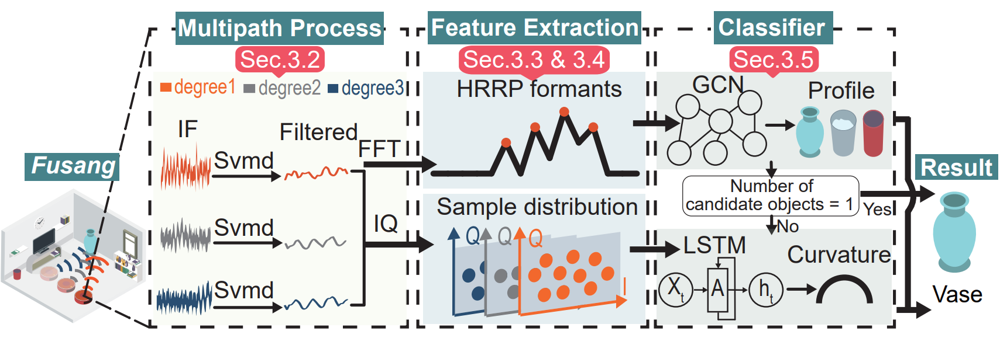

# Pro-Fusang
 This repository is an Open-source code for the paper "Graph-inspired Robust and Accurate Object Recognition on Commodity mmWave Devices". 
 

## Abstract
>Fusang is a novel object recognition system that only requires a single COTS mmWave Radar. It uses HRRP data and IQ 
samples of the reflected radar signals to achieve robust and accurate object recognition without relying on target augmentation 
or specialized optical hardware.

>The basic idea of Fusang is leveraging the large bandwidth of mmWave Radars to capture a unique set of fine-grained reflected responses generated by object shapes. Moreover, Fusang constructs two novel graphstructured features to robustly represent the reflected responses of
the signal in the frequency domain and IQ domain, and carefully designs a neural network to accurately recognize objects even in
different multipath scenarios. We have implemented a prototype of Fusang on a commodity mmWave Radar device. Our experiments with 24 different objects show that Fusang achieves a mean accuracy  of 97% in different multipath environments.

## Overview

